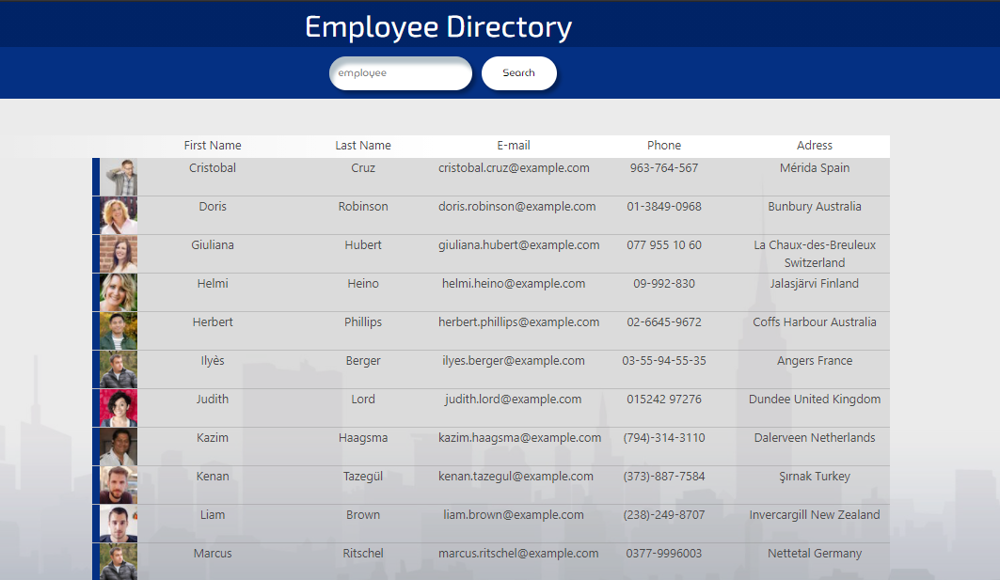
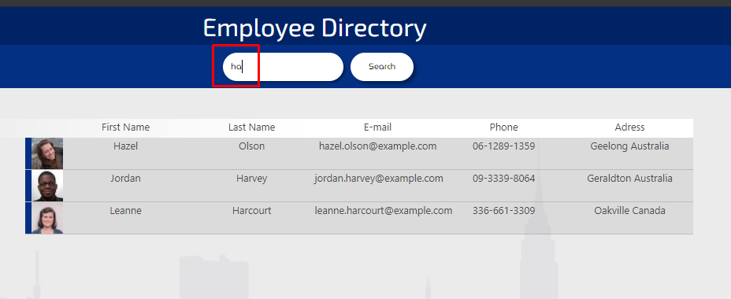
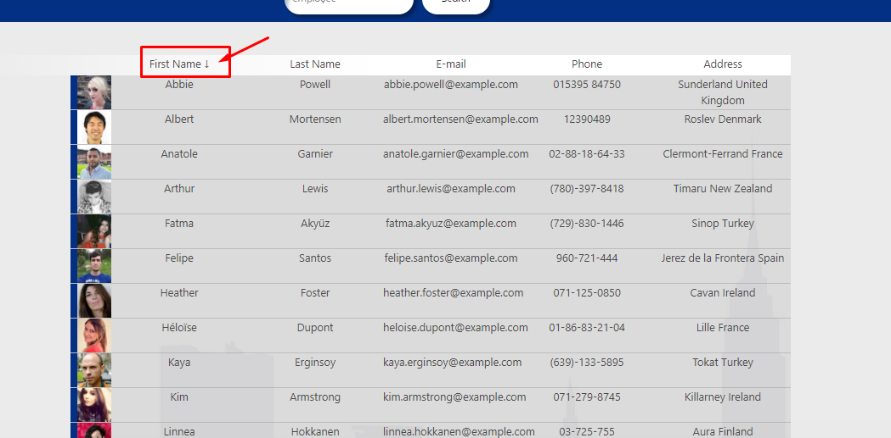

# User Directory 

## Menu

[1-Proyect Description](##Proyect-Description)

[2-Deployed Application](##Deployed-application)

[3-Proyect Usage](##Proyect-Usage)

[4-User info](##User-info)

## Proyect Description

A web page built with react that shows a set of randomized users and their info to showcase the versatility and advantages of using react in the front end of an application.

## Deployed application

[Go to site](https://jpineda30.github.io/User-Directory/index.html)

## Proyect Usage

Just load the web page and a set of users will be displayed.
When the user types something in the input field the page will filter the users that contain the characters of the input in: *name, last name or email*.
When the user clicks on the search button a new set of users will be loaded.

To order any column just click in the text in the header of the table to order in ascending or desending order.

## User info

[GitHub User: jpineda30](https://github.com/jpineda30)

In case of any doubt or clarification, contact me at:  
Email: jose.pinedaesquer@gmail.com

